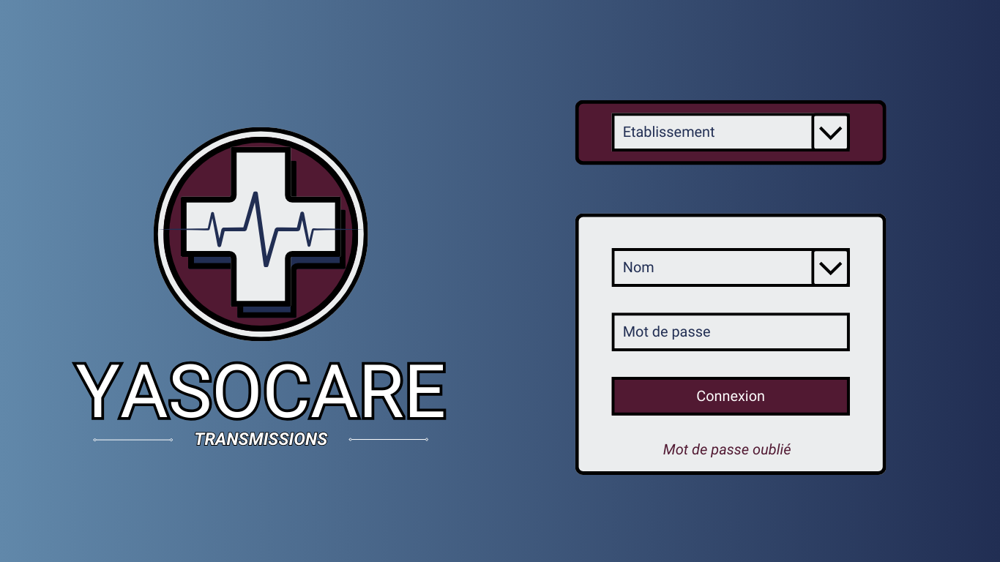
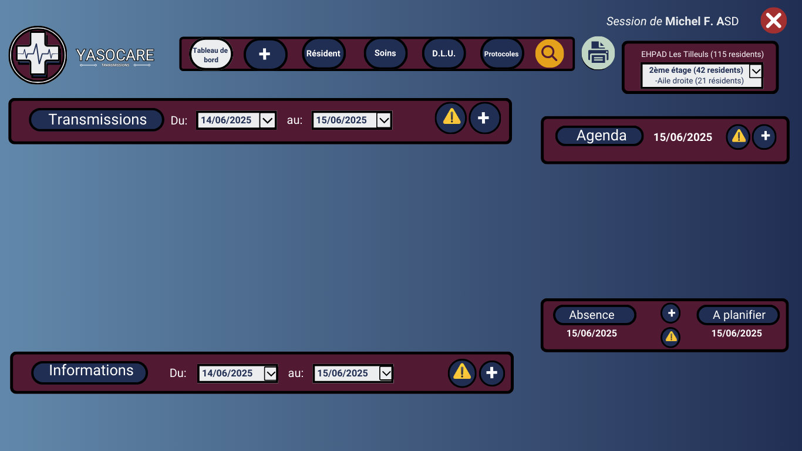
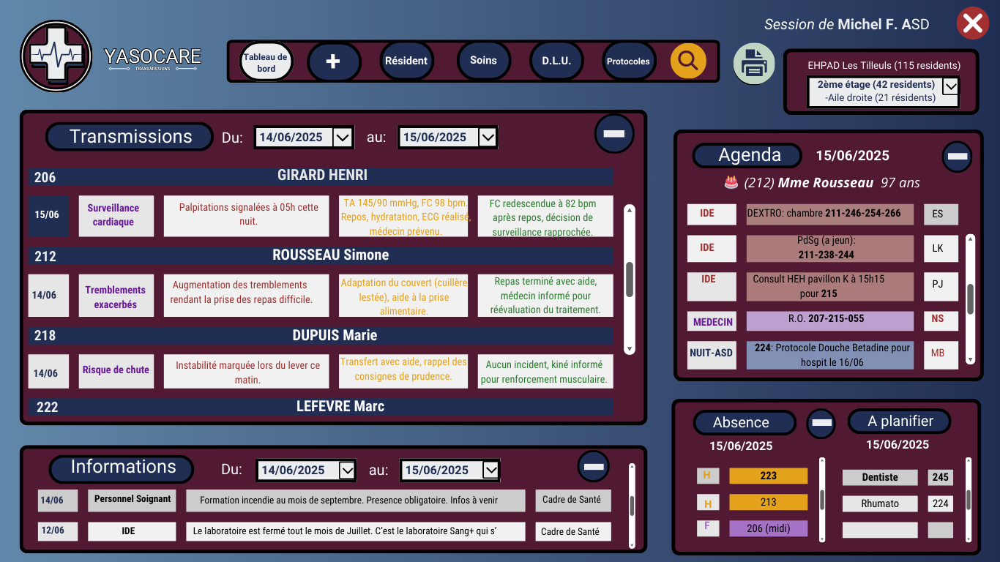
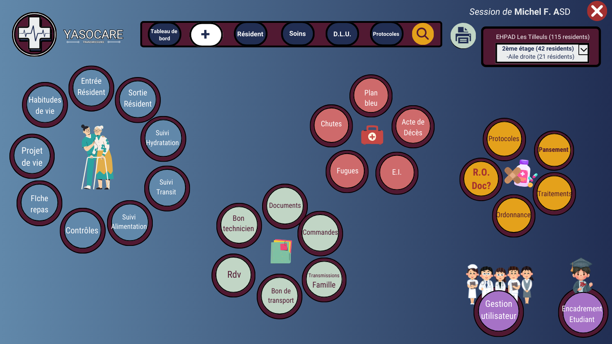
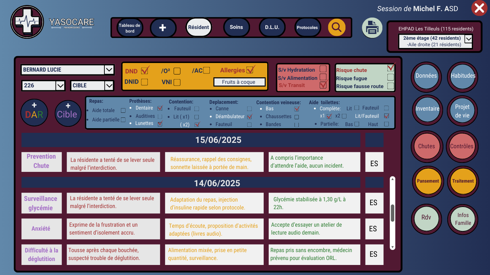
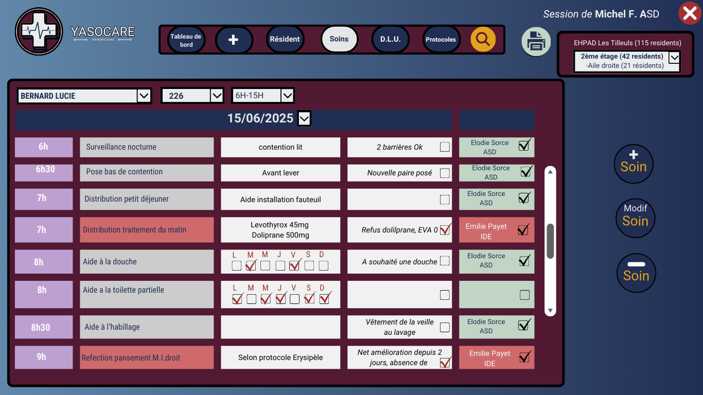
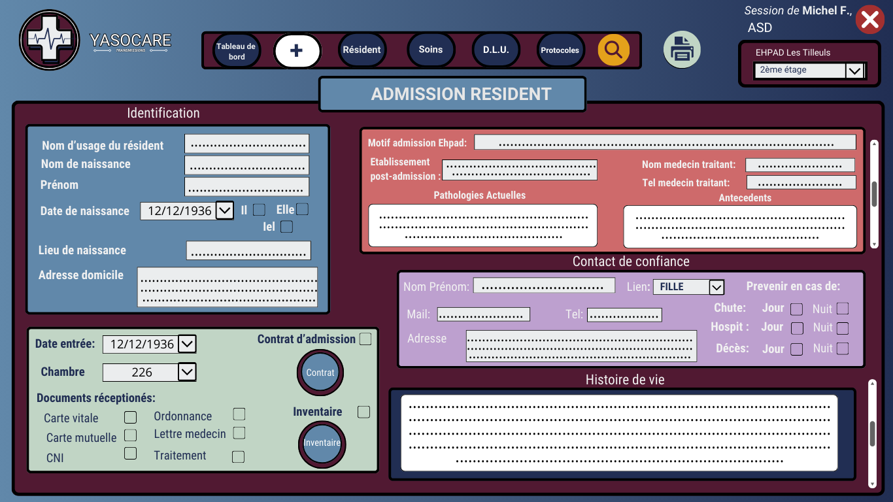

  

## État du projet

- 🚧 En cours de développement

# **Maquette**

# **1️⃣ Présentation du projet**

-**Nom du projet** : Yazocare (nom de domaine accessible à ce jour, "iaso"=  Déesse de la guérison et des soins médicaux.)

-**Description** : Application métier permettant la gestion des soins, le suivi médical des patients et la coordination des équipes soignantes.

-**Public cible** : Établissements de santé (EHPAD, cliniques, hôpitaux), soignants, infirmiers et médecins.

#  **2️⃣ Objectifs du projet** :

📌 **Faciliter la gestion des soins** : Suivi des soins administrés aux patients.

📌 **Optimiser la coordination des équipes** : Planification et communication en temps réel.

📌 **Améliorer la traçabilité des soins** : Enregistrement des interventions et historique  patient.

📌 **Simplifier la gestion des prescriptions** : Suivi des traitements alerte renouvellement d'ordonnance... (connexion a une appli de recherche de medecin de ville en cas d'absence de médecin coordinateur)

# **Fonctionnalités principales (MVP)**: 

## 🔹 **Gestion des patients:**	Création, consultation et modification des dossiers

- ***Back***: Créer une base de donnée  
- ***Front:*** Formulaire pour ajouter un patient  
- ***Front ou Back***: Création d’un document généré dynamiquement pour **DLU** (Dossier de Liaison d’Urgence) qui sera imprimable
  

##  🔹 Planification des soins: Assignation des soins aux soignants, checklist, agenda

- ***Back:*** Créer une base de donnée
- ***Front:*** Checklist pour validation Soin
- ***Front:*** Formulaire pour intégrer un nouveau soin au soignant adéquat (avec blocage selon hiérarchie)
- ***Front:*** Formulaire pour transmissions des soins ciblés (Données, Actions, Résultat) avec notion d’importance (qui s’affichera dans une fenêtre sur la page d’accueil)
- ***Front:*** Calendrier pour rdv et examens du patient avec Alerte de la CAT pour équipe de nuit/équipe de jour.
- ***Front***: Checklist pour Déclaration de chute et Déclaration d’Evènements Indésirables
    

### 🔹 Gestion des prescriptions	:Enregistrement et suivi des traitements

- ***Back:*** Créer une base de donnée
- ***Back***: Utilisation du API de medicament
- ***Front***: Formulaire pour intégrer une ordonnance et fichier PDF
- ***Front:*** Alerte/Notification dans calendrier pour ordonnance à renouveler
 

##  🔹 Gestion des accès, Sécurité : Authentification par mot de passe (admin, soignant, médecin)
  
- ***Back***: Créer une base de donnée
- ***Back:*** Définir les accès propre à la hiérarchie soignante

  
## **Fonctionnalités futures**: 
  
🔹 **Prise en compte des normes de Santé**
    
     1. Règlementation Générale sur la Protection des Données (RGPD)  
     2. Norme ISO 13485
     3. Norme ISO 27001
     4. HIPAA (Health Insurance Portability and Accountability Act)
     5. Directive sur les Dispositifs Médicaux (MDD) et Règlement sur les Dispositifs Médicaux (MDR)
     6. FDA 21 CFR Part 11
     7. IEC 62304
     8. HITECH Act (Health Information Technology for Economic and Clinical Health Act)
     9. EN 60601-1
     10. NIST Cybersecurity Framework
 
🔹 **Intégration avec un système de télémédecine si absence de médecin coordinateur (accès EHPAD)**

🔹 Intégration avec un système de transmission de **ticket technique à l'agent technique**

🔹 **Traçabilité:** Génération de rapports sur les soins administrés	

🔹  **Coordination des équipes:** Planning des soignants, messagerie interne

🔹  **Rendre responsive**: Pour utilisation sur tablette lors des soins

🔹  **Migration vers un modèle SAAS**

🔹  **Gestion des traitements**: Alerte sur la compatibilité

🔹 Gestion et suivi du patient **inter établissement**

🔹 **Intégration des protocoles** de l’établissement
  

## **Stack technique**:   

🔹**Back-end**
  - PHP 8.3
  
  - MySQL
  
  - PHP PDO (requêtes SQL sécurisées)
  
  -API Laravel

🔹**Front-end**
  - HTML 
  
  - Tailwind CSS
  
  - Javascript
 

## **Auteur**:  
*Elodie Sorce

